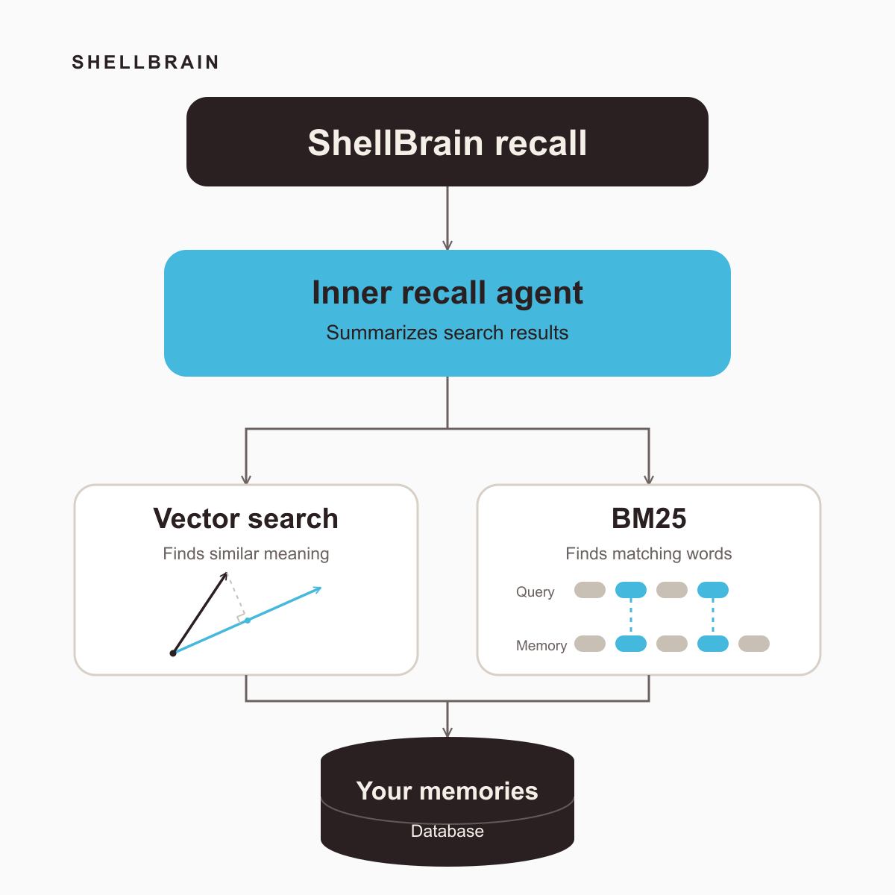

<p align="center">
  
</p>

<h3 align="center">ShellBrain</h3>

<p align="center">Long-term Memory for AI Agents.</p>

ShellBrain gives AI agents memory, so they can store and reuse what they learn over time.

## Install

```bash
curl -L shellbrain.ai/install | bash
```

**Works for Codex, Claude Code, and Cursor.**

Requirements.
- macOS or Linux, Python 3.11+, Docker for the managed local Postgres+pgvector runtime.

### Upgrade for latest capabilities

```bash
shellbrain upgrade
```
---

## Recall in one command

<p align="center">
  
</p>

---

## Architecture

ShellBrain builds memory in three grounded layers:

- **Episodic knowledge records evidence.** It stores prompts, agent steps, tool calls, and outputs from each session.
- **Empirical knowledge extracts concrete memories.** It organizes problems, solutions, failed tactics, facts, preferences, and changes in a semantic graph for **case-based reasoning**.
- **Conceptual knowledge abstracts reusable ideas.** Its concept graph connects claims, relations, and implementations to empirical knowledge.

Each higher layer links to evidence in the layer below it. Agents receive a compact orientation first, then request more detail when needed.

---

## How Agents Use ShellBrain

### Recall

Working agents run `shellbrain recall` to get one compact brief for the current task.

Recall receives only the quoted query. Include the relevant task, failure, subsystem, or decision in the question.

```bash
shellbrain recall "What is ShellBrain, and how does it help a working coding agent?"
```

**Response format:**

```json
{
  "status": "ok",
  "data": {
    "brief": {
      "summary": "...",
      "constraints": ["..."],
      "known_traps": ["..."],
      "prior_cases": ["..."],
      "concept_orientation": ["..."],
      "anchors": ["`README.md`"],
      "conflicts": ["..."],
      "gaps": ["..."],
      "next_checks": ["..."]
    },
    "fallback_reason": null
  },
  "errors": []
}
```

The brief lets the working agent focus on the current task.

### Teach

Run `shellbrain teach` only when you explicitly want ShellBrain to remember something important.

---

## Memory Discipline

ShellBrain keeps memory grounded in evidence and narrow in scope. Agents request memory when they need it.

**Memory that cannot justify itself should not persist.**

---

## Use ShellBrain

Use ShellBrain with your preferred agent. Then work as usual.

- **Claude Code:** Use `/shellbrain` to recall context at task boundaries.
- **Codex:** Use `$shellbrain` to recall context at task boundaries.
- **Cursor:** Use `/shellbrain` to recall context at task boundaries.

---

## Repair

Run `shellbrain admin doctor` to inspect the installation. If it reports a problem, run `shellbrain init`. Do not run init every session.

---

## Docs

- [For Humans](https://shellbrain.ai/humans/): installation, upgrades, and first steps
- [For Agents](https://shellbrain.ai/agents/): agent workflow and memory rules
- [Technical Docs](https://deepwiki.com/cucupac/shellbrain): detailed documentation and code map
